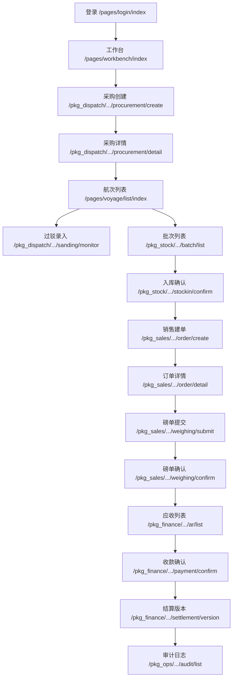

# 阶段 1：数据库蓝图 + 微信小程序信息架构

## 0. 阶段边界
- 本阶段只做“数据库蓝图 + 信息架构设计”。
- 不进入复杂业务开发（不写业务服务、不接第三方、不做复杂页面实现）。
- 对应 SQL 蓝图文件：`infra/mysql/blueprints/phase1_schema_blueprint.sql`。

## A. 数据库蓝图

### A1. 数据表清单（按域分组）
- RBAC：`users`、`roles`、`permissions`、`user_roles`、`role_permissions`
- 主数据与航次：`ships`、`procurements`、`voyages`
- 库存与现场：`inventory_batches`、`stock_ins`、`lighterings`、`expenses`
- 销售结算：`sales_orders`、`sales_line_items`、`weighing_slips`、`payments`
- 审批与版本：`approvals`、`settlement_versions`、`allocation_versions`
- 风险审计：`alerts`、`audit_logs`

### A2. 统一口径落地（关键规则）
- `1 Voyage = 1 Procurement`：`voyages.procurement_id` 设唯一约束。
- `Voyage` 为成本归集与利润核算主线：`expenses`、`inventory_batches`、`lighterings`、`settlement_versions` 均关联 `voyage_id`。
- `InventoryBatch` 为销售选货主对象：`sales_line_items.batch_id` 必填。
- `available_qty` 仅由入库确认更新：`inventory_batches.available_qty` 由 `stock_ins` 触发器更新，直接改值会被拦截。
- 销售归属：`sales_orders -> sales_line_items -> batch/voyage`。
- `final_total_qty` 唯一最终吨数：`weighing_slips` 通过 `is_final + final_key` 保证每单仅一条最终磅单；`sales_orders.final_total_qty` 为订单最终口径。
- 锁定态关键变更先审批后生效：通过 `approvals + settlement_versions/allocation_versions`。
- 历史版本只读：`settlement_versions`、`allocation_versions` 触发器禁止改删历史版本。
- 审计日志不可删除：`audit_logs` 删除触发器强阻断。
- 收款确认不可撤销：`payments` 对 `CONFIRMED` 状态禁止更新/删除。

### A3. 每表核心字段

| 表 | 核心字段 |
|---|---|
| users | id, username, phone, password_hash, display_name, status |
| roles | id, role_code, role_name, status |
| permissions | id, perm_code, resource, action |
| user_roles | user_id, role_id, assigned_by, assigned_at |
| role_permissions | role_id, permission_id |
| ships | id, ship_no, ship_name, mmsi, last_position_time, status |
| procurements | id, procurement_no, planned_qty, unit_price, mining_ticket_url, quality_photo_urls, sand_start_time, status |
| voyages | id, voyage_no, ship_id, procurement_id, status, locked_at, completed_at |
| inventory_batches | id, batch_no, voyage_id, available_qty, locked_qty, shipped_qty, remaining_qty, status |
| stock_ins | id, stock_in_no, batch_id, version_no, confirmed_qty, stock_in_time, status, approval_id |
| lighterings | id, lightering_no, voyage_id, transfer_type, lightering_qty, is_main_ship_empty, status |
| expenses | id, expense_no, voyage_id, expense_type, amount, occurred_at, status |
| sales_orders | id, sales_order_no, customer_name, status, ar_status, planned_total_qty, final_total_qty, unit_price, total_amount |
| sales_line_items | id, sales_order_id, line_no, batch_id, voyage_id, planned_qty, final_qty, allocation_version_id |
| weighing_slips | id, slip_no, sales_order_id, planned_qty, final_total_qty, is_final, status, confirmed_by |
| payments | id, payment_no, sales_order_id, payment_amount, payment_method, status, confirmed_at |
| alerts | id, alert_no, alert_type, related_entity_type, related_entity_id, severity, status, handle_note |
| approvals | id, approval_no, approval_type, target_entity_type, target_entity_id, status, before_snapshot, after_snapshot |
| settlement_versions | id, voyage_id, version_no, snapshot_type, procurement_cost, expense_total, revenue_amount, profit_amount, status, is_current |
| allocation_versions | id, sales_order_id, version_no, allocation_payload, status, is_current |
| audit_logs | id, trace_id, actor_user_id, action, entity_type, entity_id, before_data, after_data, event_time |

### A4. 主键 / 外键 / 唯一约束（关键）

| 表 | 主键 | 关键外键 | 关键唯一约束 |
|---|---|---|---|
| users | id | - | username, phone |
| roles | id | - | role_code |
| permissions | id | - | perm_code |
| user_roles | (user_id, role_id) | user_id -> users.id, role_id -> roles.id | 复合主键即唯一 |
| role_permissions | (role_id, permission_id) | role_id -> roles.id, permission_id -> permissions.id | 复合主键即唯一 |
| ships | id | - | ship_no, mmsi |
| procurements | id | created_by -> users.id | procurement_no |
| voyages | id | ship_id -> ships.id, procurement_id -> procurements.id | voyage_no, procurement_id(唯一，确保1:1) |
| inventory_batches | id | voyage_id -> voyages.id | batch_no |
| stock_ins | id | batch_id -> inventory_batches.id, approval_id -> approvals.id | stock_in_no, (batch_id, version_no) |
| lighterings | id | voyage_id -> voyages.id | lightering_no |
| expenses | id | voyage_id -> voyages.id | expense_no |
| sales_orders | id | sales_user_id -> users.id | sales_order_no |
| sales_line_items | id | sales_order_id -> sales_orders.id, batch_id -> inventory_batches.id, voyage_id -> voyages.id | (sales_order_id, line_no) |
| weighing_slips | id | sales_order_id -> sales_orders.id | slip_no, final_key(每单唯一最终磅单) |
| payments | id | sales_order_id -> sales_orders.id | payment_no |
| alerts | id | handled_by -> users.id | alert_no |
| approvals | id | requested_by/reviewed_by -> users.id | approval_no |
| settlement_versions | id | voyage_id -> voyages.id, based_on_version_id -> settlement_versions.id | (voyage_id, version_no) |
| allocation_versions | id | sales_order_id -> sales_orders.id | (sales_order_id, version_no) |
| audit_logs | id | actor_user_id -> users.id | 无业务唯一，按 append-only |

### A5. 状态枚举（建议）

| 对象 | 枚举 |
|---|---|
| users.status | ACTIVE, DISABLED, LOCKED |
| roles.status | ACTIVE, DISABLED |
| ships.status | IDLE, IN_VOYAGE, MAINTENANCE, DISABLED |
| procurements.status | PENDING_DISPATCH, DISPATCHED, SANDING, IN_TRANSIT, WAIT_LIGHTERING, COMPLETED, VOID |
| voyages.status | IN_PROGRESS, LOCKED, COMPLETED, VOID |
| inventory_batches.status | PENDING_STOCK_IN, AVAILABLE, PARTIALLY_ALLOCATED, SOLD_OUT, VOID |
| stock_ins.status | PENDING, CONFIRMED, SUPERSEDED, VOID |
| lighterings.status | DRAFT, IN_PROGRESS, MAIN_EMPTY_CONFIRMED, VOID |
| expenses.status | DRAFT, CONFIRMED, VOID |
| sales_orders.status | DRAFT, LOCKED_STOCK, PENDING_FINAL_QTY_CONFIRM, READY_FOR_PAYMENT_CONFIRM, COMPLETED, VOID |
| sales_orders.ar_status | ESTIMATED_AR, FINAL_AR |
| sales_line_items.status | LOCKED, FINALIZED, VOID |
| weighing_slips.status | UPLOADED, PENDING_CONFIRM, CONFIRMED, VOID |
| payments.status | PENDING, CONFIRMED, VOID |
| alerts.status | OPEN, ACKED, CLOSED |
| approvals.status | PENDING, APPROVED, REJECTED, CANCELED |
| settlement_versions.status | PENDING_APPROVAL, EFFECTIVE, SUPERSEDED, REJECTED |
| allocation_versions.status | PENDING_APPROVAL, EFFECTIVE, SUPERSEDED, REJECTED |

## B. 微信小程序信息架构

### B1. tabBar 方案（5 栏）
- `pages/workbench/index`：工作台（角色化入口）
- `pages/voyage/list/index`：航次
- `pages/sales/order/list/index`：销售
- `pages/alert/center/index`：预警
- `pages/me/index`：我的

### B2. 分包方案
- 主包（高频首屏）
  - `pages/login/index`
  - `pages/workbench/index`
  - `pages/voyage/list/index`
  - `pages/sales/order/list/index`
  - `pages/alert/center/index`
  - `pages/me/index`
- `pkg_dispatch`（调度与采购）
  - `pages/dispatch/procurement/create/index`
  - `pages/dispatch/procurement/detail/index`
  - `pages/dispatch/sanding/monitor/index`
  - `pages/dispatch/ship/position/index`
- `pkg_stock`（库存与入库）
  - `pages/stock/batch/list/index`
  - `pages/stock/batch/detail/index`
  - `pages/stock/stockin/confirm/index`
  - `pages/stock/stockin/history/index`
- `pkg_sales`（销售与磅单）
  - `pages/sales/order/create/index`
  - `pages/sales/order/detail/index`
  - `pages/sales/lineitem/allocate/index`
  - `pages/sales/weighing/submit/index`
  - `pages/sales/weighing/confirm/index`
- `pkg_finance`（财务与审批）
  - `pages/finance/ar/list/index`
  - `pages/finance/payment/confirm/index`
  - `pages/finance/approval/list/index`
  - `pages/finance/settlement/version/index`
- `pkg_ops`（审计与系统）
  - `pages/ops/audit/list/index`
  - `pages/ops/role/permission/index`

### B3. 页面路径清单（建议）
- 主包：
  - `/pages/login/index`
  - `/pages/workbench/index`
  - `/pages/voyage/list/index`
  - `/pages/sales/order/list/index`
  - `/pages/alert/center/index`
  - `/pages/me/index`
- `pkg_dispatch`：
  - `/pkg_dispatch/pages/dispatch/procurement/create/index`
  - `/pkg_dispatch/pages/dispatch/procurement/detail/index`
  - `/pkg_dispatch/pages/dispatch/sanding/monitor/index`
  - `/pkg_dispatch/pages/dispatch/ship/position/index`
- `pkg_stock`：
  - `/pkg_stock/pages/stock/batch/list/index`
  - `/pkg_stock/pages/stock/batch/detail/index`
  - `/pkg_stock/pages/stock/stockin/confirm/index`
  - `/pkg_stock/pages/stock/stockin/history/index`
- `pkg_sales`：
  - `/pkg_sales/pages/sales/order/create/index`
  - `/pkg_sales/pages/sales/order/detail/index`
  - `/pkg_sales/pages/sales/lineitem/allocate/index`
  - `/pkg_sales/pages/sales/weighing/submit/index`
  - `/pkg_sales/pages/sales/weighing/confirm/index`
- `pkg_finance`：
  - `/pkg_finance/pages/finance/ar/list/index`
  - `/pkg_finance/pages/finance/payment/confirm/index`
  - `/pkg_finance/pages/finance/approval/list/index`
  - `/pkg_finance/pages/finance/settlement/version/index`
- `pkg_ops`：
  - `/pkg_ops/pages/ops/audit/list/index`
  - `/pkg_ops/pages/ops/role/permission/index`

### B4. 角色首页结构（工作台）

| 角色 | 首页卡片（建议） | 首要动作 |
|---|---|---|
| 采购/调度 | 待派船、打沙超时、待处理预警、航次在途 | 创建采购单/派船、进入打沙监控 |
| 现场/过驳 | 待过驳、待卸空确认、待入库确认、费用待录入 | 过驳录入、入库确认、费用录入 |
| 销售 | 可售批次、待补价订单、待提交磅单 | 新建销售单、提交磅单 |
| 财务/管理 | 待磅单差异确认、Estimated AR、待确认收款、待审批 | 确认差异、确认收款、审批 |
| 超级管理员 | 权限变更、审计告警、版本修订记录 | 权限配置、审计追溯 |

### B5. 页面跳转关系（核心）

### B6. 页面与数据库表映射关系（核心）

| 页面 | 读表 | 写表 |
|---|---|---|
| 登录/我的 | users, user_roles, roles | users(登录态更新时间) |
| 工作台 | alerts, voyages, procurements, sales_orders, approvals | - |
| 采购创建/详情 | ships, procurements, voyages | procurements, voyages, audit_logs |
| 打沙监控 | procurements, alerts | procurements, alerts, audit_logs |
| 船舶定位 | ships, alerts | ships(last_position_time), alerts |
| 批次列表/详情 | inventory_batches, voyages | inventory_batches(状态流转) |
| 入库确认/历史 | inventory_batches, stock_ins, approvals | stock_ins, inventory_batches(触发更新), approvals, audit_logs |
| 销售建单/详情 | inventory_batches, sales_orders, sales_line_items, voyages | sales_orders, sales_line_items, allocation_versions, audit_logs |
| 磅单提交/确认 | weighing_slips, sales_orders, sales_line_items | weighing_slips, sales_orders(final_total_qty), sales_line_items(final_qty), audit_logs |
| 应收/收款 | sales_orders, payments | payments, sales_orders(status/ar_status), audit_logs |
| 审批列表 | approvals, settlement_versions, allocation_versions | approvals, settlement_versions, allocation_versions, audit_logs |
| 结算版本 | settlement_versions, voyages, expenses | settlement_versions, approvals, audit_logs |
| 审计中心 | audit_logs | audit_logs(系统自动写) |

## C. 与现有项目冲突点
- 当前小程序仅 3 个演示页面（`index/voyage/alerts`），与目标 IA（主包+多分包）差距大。
- 当前 `app.json` 无角色化首页、无分包声明、无审批/结算/入库链路页面。
- 当前代码无登录鉴权与 RBAC 菜单裁剪能力（只具备静态页面）。
- 项目根目录存在一份额外 `project.config.json`，与 `apps/mobile/project.config.json` 并存，容易导入误用。
- 现有数据库仅有建库脚本，尚未落地业务表结构与约束。

## D. 本阶段结论
- 已完成数据库蓝图与小程序信息架构设计。
- 已将可执行 SQL 蓝图落盘，后续可在“阶段 2”进行 DDL 执行与接口契约设计。
- 本阶段不进入复杂开发，符合你的边界要求。

